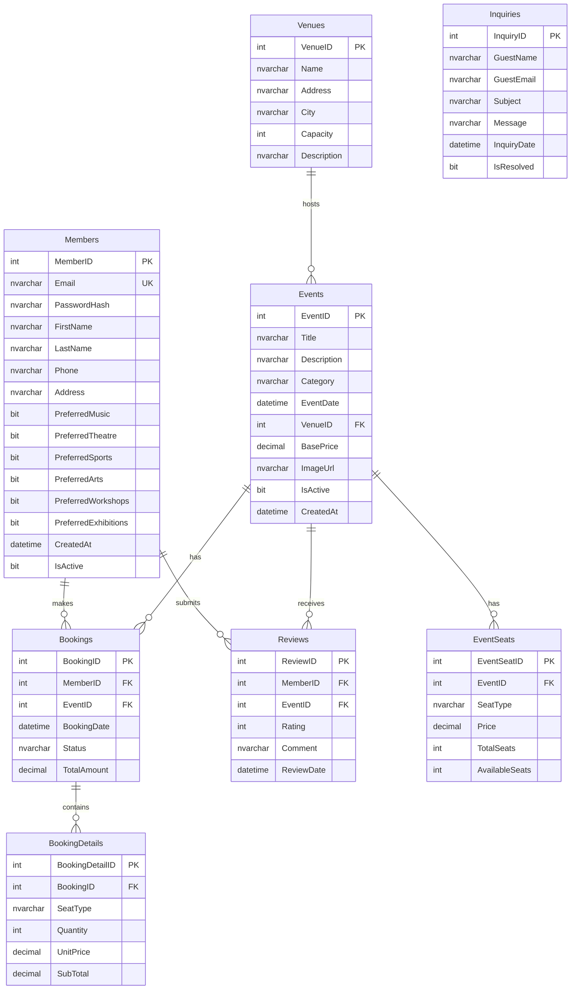

# ER Diagram - Smart Event Management and Ticketing System

## Entity Relationship Diagram (Mermaid)

## Relationship Summary

| Relationship | Cardinality | Description |
|--------------|-------------|-------------|
| Member - Booking | 1:N | A member can make many bookings |
| Member - Review | 1:N | A member can submit many reviews |
| Event - Booking | 1:N | An event can have many bookings |
| Event - EventSeats | 1:N | An event has multiple seat types |
| Event - Review | 1:N | An event can receive many reviews |
| Venue - Event | 1:N | A venue hosts many events |
| Booking - BookingDetails | 1:N | A booking contains multiple ticket lines |

## SQL Developer Data Modeler Notes

To convert this design in Oracle SQL Developer Data Modeler:

1. **Create Logical Model**: Create entities for Members, Venues, Events, EventSeats, Bookings, BookingDetails, Reviews, and Inquiries
2. **Define Attributes**: Use the Data Dictionary for exact attribute definitions
3. **Create Relationships**: Draw relationships with correct cardinality (1:N)
4. **Generate Physical Model**: Choose SQL Server as target
5. **Generate DDL**: Export to SQL Server compatible scripts
